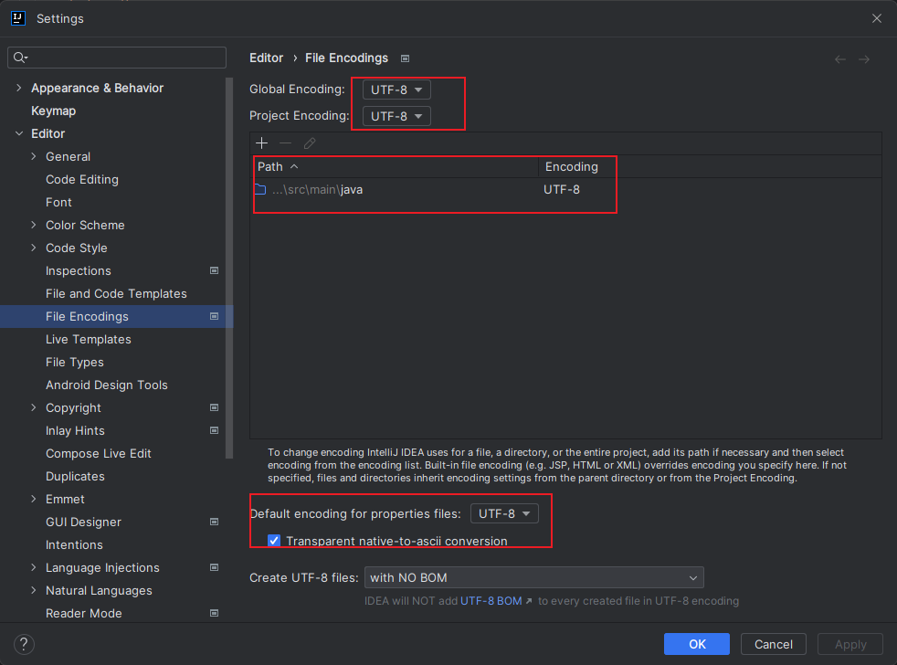

1、org.yaml.snakeyaml.error.YAMLException: java.nio.charset.MalformedInputException: Input length = 1  
原因：文件编码不一致  
解决方法：统一使用utf-8编码  
https://blog.csdn.net/twotwo22222/article/details/124605029  

